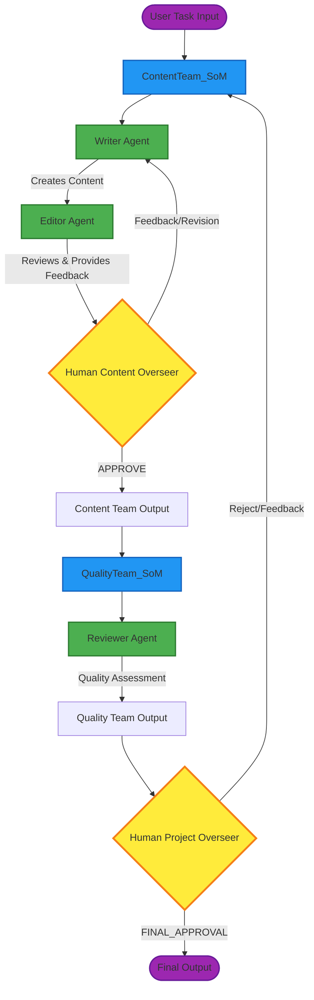

# Society of Mind with Human-in-the-Loop

[](https://python.org)
[](https://github.com/microsoft/autogen)

> **A sophisticated multi-agent content creation system implementing Microsoft AutoGen's Society of Mind (SoM) framework with strategic human oversight integration.**

## 🚀 Overview

This project demonstrates an advanced implementation of the **Society of Mind** architecture using Microsoft AutoGen, featuring intelligent multi-agent collaboration with human-in-the-loop integration at critical decision points. The system orchestrates multiple AI agents working together to create, edit, and review content while maintaining human oversight throughout the process.

### Key Features

- 🤖 **Multi-Agent Collaboration**: Writer, Editor, and Reviewer agents working in harmony
- 👥 **Human-in-the-Loop**: Strategic human oversight at critical decision points
- 🎯 **Society of Mind Architecture**: Nested team structures with inner and outer coordination
- 🌐 **Interactive Web Interface**: FastAPI backend with WebSocket support for real-time interaction
- 📊 **Comprehensive Logging**: Structured logging with custom logger implementation
- 🛡️ **Error Handling**: Robust exception handling with custom exception classes
- ⚡ **Asynchronous Processing**: Efficient async/await implementation for better performance

## 🏗️ Architecture

### Workflow Architecture



**Workflow Steps:**

1. **User Input** → Task enters the system
2. **ContentTeam_SoM** → Coordinates inner content creation team
3. **Writer Agent** → Creates initial content
4. **Editor Agent** → Reviews and provides feedback
5. **Human Content Overseer** → Approves or requests revisions
6. **Quality Team** → Assesses content quality
7. **Reviewer Agent** → Performs quality validation
8. **Human Project Overseer** → Final approval or rejection
9. **Final Output** → Completed content delivered

### Agent Roles

- **Writer Agent**: Expert content creator focused on generating high-quality written content
- **Editor Agent**: Content editor providing actionable feedback and improvements
- **Reviewer Agent**: Quality assurance specialist ensuring content meets standards
- **Human Overseers**: Strategic human intervention points for critical decisions
- **Society of Mind Agents**: Coordinate inner team communications with outer team

## 📋 Prerequisites

- Python 3.11+
- Google AI API Key (Gemini 2.5 Flash)
- Virtual environment (recommended)

## 🛠️ Installation

### 1. Clone the Repository

```bash
git clone https://github.com/avnishs17/society_of_minds_autogen.git
cd society_of_minds_autogen
```

### 2. Create Virtual Environment

```bash
# Windows
python -m venv .venv
.venv\Scripts\activate

# macOS/Linux
python -m venv .venv
source .venv/bin/activate
```

### 3. Install Dependencies

```bash
pip install -r requirements.txt
```

### 4. Environment Configuration

Create a `.env` file in the root directory:

```bash
# Copy the example file
cp .env.example .env
```

Edit `.env` and add your API key:

```env
GOOGLE_API_KEY=your_google_ai_api_key_here
```

## 🚀 Usage

### Running the Web Application

```bash
python backend.py
```

The application will be available at `http://localhost:8000`

### Example Task

Try this sample task to demonstrate the system:

```
Write a blog post about the benefits of morning routines for productivity and mental health.
Include practical tips that busy professionals can implement within 30 minutes each morning.
```

### How It Works

1. **Task Input**: Enter your content creation task in the web interface
2. **Agent Collaboration**: The system initiates multi-agent collaboration
3. **Content Creation**: Writer creates initial content, Editor provides feedback
4. **Human Oversight**: Human overseer reviews and approves content decisions
5. **Quality Assurance**: Reviewer agent assesses final content quality
6. **Final Approval**: Project overseer makes final approval decision
7. **Result**: Refined, high-quality content delivered through iterative collaboration

## 📁 Project Structure

```
som_feedback/
├── config/                     # Configuration files
│   └── constants.py           # API keys and model configuration
├── custom_exception/          # Custom exception handling
│   └── custom_exception.py   # Application-specific exceptions
├── experiment/               # Jupyter notebooks for testing
│   └── assignment.ipynb     # Development and testing notebook
├── logger/                  # Logging infrastructure
│   └── custom_logger.py    # Structured logging implementation
├── logs/                   # Log files
├── src/                    # Core application logic
│   ├── prompt_library/     # Agent system messages
│   │   └── system_messages.py
│   └── som/               # Society of Mind implementation
│       └── team_setup.py  # Agent and team creation
├── ui/                    # User interface
│   └── index.html        # Web application frontend
├── backend.py            # FastAPI backend server
├── .env.example          # Environment variables template
├── .gitignore           # Git ignore rules
├── requirements.txt     # Python dependencies
├── setup.py            # Package setup configuration
└── README.md          # This file
```

## 🔧 Configuration

### Model Configuration

The system is configured to use Google's Gemini 2.5 Flash model. You can modify the model in `config/constants.py`:

```python
MODEL_NAME = 'gemini-2.5-flash'
```

### Agent System Messages

Customize agent behaviors by modifying system messages in `src/prompt_library/system_messages.py`:

- `WRITER_SYSTEM_MESSAGE`: Defines writer agent behavior
- `EDITOR_SYSTEM_MESSAGE`: Defines editor agent behavior  
- `REVIEWER_SYSTEM_MESSAGE`: Defines reviewer agent behavior

### Termination Conditions

- Inner teams terminate on "APPROVE" keyword
- Outer team terminates on "FINAL_APPROVAL" keyword
- Maximum turn limits prevent infinite loops

## 🧪 Development

### Running Tests

```bash
# Navigate to experiment directory
cd experiment
jupyter lab assignment.ipynb
```

### Logging

The system uses structured logging with the following levels:

- `INFO`: General operation information
- `ERROR`: Error conditions and exceptions
- `DEBUG`: Detailed debugging information

Logs are stored in the `logs/` directory with timestamps.

### Custom Exceptions

The system includes custom exception handling:

- `SoMApplicationException`: General application errors
- `AgentCreationError`: Agent initialization failures
- `TeamCreationError`: Team setup failures

## 📊 Features in Detail

### Human-in-the-Loop Integration

- **Strategic Placement**: Human oversight at critical decision points
- **Non-Blocking**: Async implementation doesn't halt other operations  
- **Contextual**: Human input functions receive relevant context
- **Flexible**: Multiple human overseer roles for different decision types

### Multi-Agent Collaboration

- **Round Robin Communication**: Structured agent interaction patterns
- **Termination Conditions**: Intelligent stopping criteria
- **Error Recovery**: Robust error handling and recovery mechanisms
- **Scalable Architecture**: Easy to add new agents and teams

### Web Interface

- **Real-time Updates**: WebSocket connection shows agent interactions live
- **Message History**: Complete conversation history maintained
- **Error Display**: User-friendly error messages and handling
- **Responsive Design**: HTML/CSS interface that works on desktop and mobile devices

